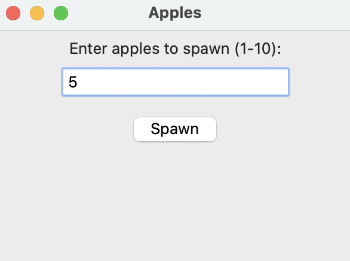
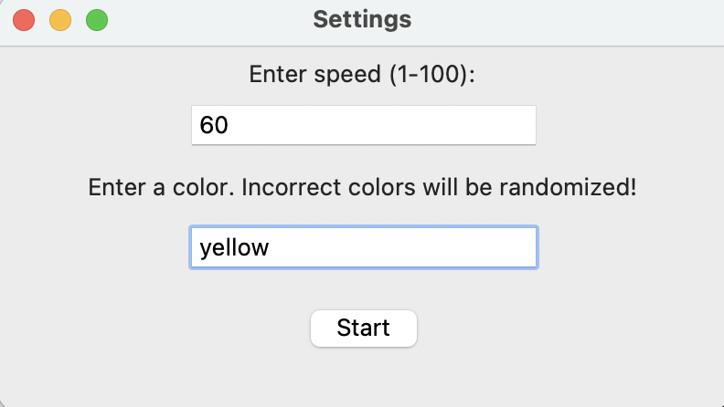
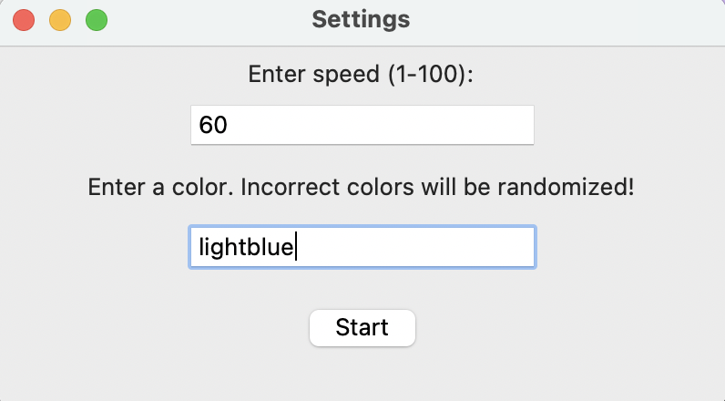
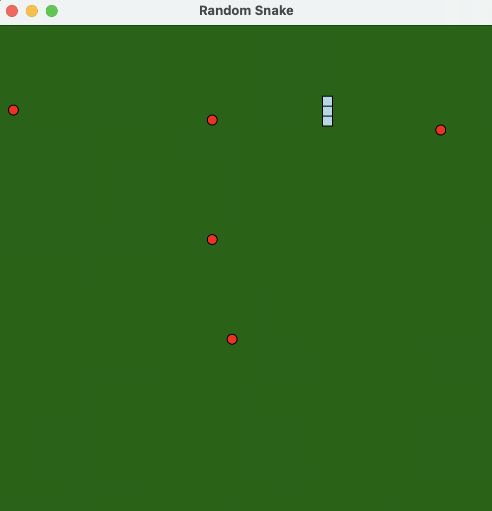

This package is run from the command line, so we will be showing the ways you can see each function in action.

### move_random(space_key)

For every key-press of the space key, you will see the current snake's direction in your terminal.

Here is an example snippet of the output in terminal:
```
Current snake direction: right
Current snake direction: up
Current snake direction: right
Current snake direction: down
```

### spawn_apples(apple_num)
You will also see a menu for setting the number of apples, which is set by the user before the game starts.



### speed(speed_number)
The speed of the snake will also be shown, and is also set by the user before the game starts. The default value is 50.



### color(color_name)
The color of the snake is set in the same menu as the speed.



### Example of gameplay

Here is an example of this particular game setup:




